# Midport SQL Platform - Simple Overview

## 🎯 **What This System Does**

The Midport SQL Platform is like a **translator and bridge** between you and your business data. Instead of learning complicated technical systems, you can ask for data using simple SQL queries (like asking questions in a structured way), and the system handles all the complex technical work behind the scenes.

## 🔄 **How It Works (In Simple Terms)**

```mermaid
graph LR
    USER["👤 Business User<br/>Types SQL Query"] --> PLATFORM["🖥️ Midport Platform<br/>Translates & Processes"]
    PLATFORM --> ION["☁️ ION System<br/>Gets Your Data"]
    ION --> PLATFORM
    PLATFORM --> RESULTS["📊 Formatted Results<br/>Easy to Read"]
```



### **Step-by-Step Process:**

1. **You Type a Query** 📝
   - Example: `SELECT * FROM Orders WHERE Country = 'Norway'`
   - Just like asking: "Show me all orders from Norway"

2. **System Translates** 🔄
   - Converts your simple request into technical language
   - Handles security and authentication automatically
   - Connects to the right data source (REST or SOAP)

3. **Gets Your Data** 📡
   - Securely connects to ION system
   - Retrieves exactly what you asked for
   - Limits results to 15 records for fast loading

4. **Shows Results** 📋
   - Displays data in an easy-to-read table
   - Includes summary information
   - Ready for analysis or export

## 🔐 **How Security Works (Don't Worry, It's Automatic!)**

```mermaid
graph TB
    YOU["👤 You<br/>Just click 'Run Query'"] 
    SYSTEM["🛡️ System<br/>Handles Security<br/>(You don't see this)"]
    ION["🏢 ION System<br/>Verifies & Gets Data"]
    RESULTS["✅ Your Data<br/>Safely Delivered"]
    
    YOU --> SYSTEM
    SYSTEM -.->|🔑 Gets Permission| ION
    ION -.->|📊 Sends Data| SYSTEM
    SYSTEM --> RESULTS
    
    style SYSTEM fill:#e1f5fe
    style ION fill:#f3e5f5
    style RESULTS fill:#e8f5e8
```



### **Security Made Simple:**

🔒 **What happens behind the scenes (automatically):**
- System logs in to ION using secure credentials
- Gets a "permission ticket" (token) that expires after 2 hours
- Uses this ticket to access your data safely
- Refreshes the ticket automatically when needed

👥 **What you need to do:**
- **Nothing!** Just use the system normally
- Your data is always protected
- No passwords or technical setup required

## 📋 **How You Get Your Data (Easy Steps)**

```mermaid
graph LR
    subgraph "What You Do"
        INPUT["📝 You Type:<br/>'Show me active orders'<br/>(in SQL format)"]
    end
    
    subgraph "What System Does"
        TRANSLATE["🔄 Translates to:<br/>'Get active orders<br/>from Orders table'"]
        CONNECT["🔗 Connects to:<br/>Orders Database<br/>(Company 2405)"]
    end
    
    subgraph "What You Get"
        RESULTS["📋 Clean Results:<br/>• Order numbers<br/>• Customer names<br/>• Status info<br/>(First 15 records)"]
    end
    
    INPUT --> TRANSLATE
    TRANSLATE --> CONNECT  
    CONNECT --> RESULTS
```



### **Real Example:**

**You ask:** `SELECT * FROM Orders WHERE Status = 'Active'`

**System understands:** "Get all order information where the status is Active"

**System does the work:**
- Connects to the Orders database in your company (2405)
- Asks for active orders only
- Gets the data safely and securely
- Limits to first 15 records for fast loading

**You get:**
| Order Number | Customer | Status | Date | Amount |
|--------------|----------|--------|------|--------|
| SO001234 | Acme Corp | Active | 2024-10-01 | $15,000 |
| SO001235 | Tech Ltd | Active | 2024-10-02 | $8,500 |
| ... | ... | ... | ... | ... |

## 🏢 **Two Ways to Get Data (You Don't Need to Know the Difference!)**

### **Modern Way (REST) vs Traditional Way (SOAP)**

```mermaid
graph TB
    subgraph "Your Experience (Same for Both)"
        YOU2["👤 You Type SQL<br/>'Show me customers'"]
        RESULT2["📋 Same Easy Results<br/>Customer list in table"]
    end
    
    subgraph "Behind the Scenes (System Chooses)"
        REST["🔄 Modern Way (REST)<br/>• Faster<br/>• Direct access<br/>• JSON format"]
        SOAP["📦 Traditional Way (SOAP)<br/>• Reliable<br/>• Structured<br/>• XML format"]
    end
    
    YOU2 --> REST
    YOU2 --> SOAP
    REST --> RESULT2
    SOAP --> RESULT2
    
    style REST fill:#e8f5e8
    style SOAP fill:#fff3e0
```



### **What This Means for You:**

✅ **Same Experience:** Whether the system uses REST or SOAP, you type the same SQL and get the same results

✅ **System Decides:** The platform automatically chooses the best method for each data source

✅ **No Learning Required:** You don't need to understand the technical differences

**Example:**
- **Your query:** `SELECT * FROM Customers WHERE Type = 'VIP'`
- **System:** Automatically uses the best method to get VIP customers
- **Your result:** Clean table showing VIP customer information

## 📋 **What Data Can You Access?**

### **Available Business Information:**

```mermaid
graph TB
    YOU["👤 You Can Ask For:"] 
    
    subgraph "Sales & Orders 📈"
        ORDERS["📋 Sales Orders<br/>• Order numbers<br/>• Customer details<br/>• Status & dates<br/>• Amounts"]
        CUSTOMERS["👥 Customers<br/>• Company names<br/>• Contact info<br/>• Address details<br/>• Credit status"]
    end
    
    subgraph "Service & Support 🛠️"
        SERVICE["🔧 Service Orders<br/>• Service calls<br/>• Technician info<br/>• Equipment details<br/>• Status updates"]
    end
    
    subgraph "HR & Personnel 👨‍💼"
        EMPLOYEES["👨‍💼 Employee Info<br/>• Names & roles<br/>• Department info<br/>• Contact details<br/>• Status info"]
    end
    
    subgraph "Finance & Accounting 💰"
        ACCOUNTS["💰 Accounts<br/>• Account numbers<br/>• Balances<br/>• Transaction history<br/>• Categories"]
        INVOICES["🧾 Invoices<br/>• Invoice numbers<br/>• Customer details<br/>• Amounts & dates<br/>• Payment status"]
    end
    
    YOU --> ORDERS
    YOU --> CUSTOMERS  
    YOU --> SERVICE
    YOU --> EMPLOYEES
    YOU --> ACCOUNTS
    YOU --> INVOICES
```



## ✨ **Key Benefits for Your Business**

### **Why This System is Valuable:**

```mermaid
graph TB
    subgraph "Before (Problems) 😩"
        PROB1["👨‍💼 Need IT help<br/>for every report"]
        PROB2["⏰ Wait hours/days<br/>for simple data"]
        PROB3["🤷 Complex systems<br/>hard to learn"]
        PROB4["📈 Data in different<br/>places & formats"]
    end
    
    subgraph "After (Solutions) 🚀"
        SOL1["🎆 Self-service<br/>Get data yourself"]
        SOL2["⚡ Instant results<br/>within seconds"]
        SOL3["📝 Simple SQL<br/>Easy to learn"]
        SOL4["🌐 All data unified<br/>in one place"]
    end
    
    PROB1 -.->|Solved by| SOL1
    PROB2 -.->|Solved by| SOL2  
    PROB3 -.->|Solved by| SOL3
    PROB4 -.->|Solved by| SOL4
```



## 💼 **Real Business Use Cases**

### **Daily Business Questions You Can Answer:**

📈 **Sales Manager:**
- "Show me all orders from this month"
- "Which customers haven't ordered recently?"
- "What's our top-selling products?"

🔧 **Service Manager:**
- "List all open service tickets"
- "Which technician is handling the most calls?"
- "Show equipment that needs maintenance"

💰 **Finance Manager:**
- "Display outstanding invoices over 30 days"
- "Show monthly revenue by customer"
- "List accounts with unusual activity"

👨‍💼 **HR Manager:**
- "Show employees by department"
- "List contact information for staff"
- "Display employee status updates"

## 🛡️ **Why Your Data is Safe**

### **Security You Can Trust:**

🔒 **Automatic Protection:**
- No passwords to remember
- No sensitive data stored locally
- Secure connections to all systems
- Regular security updates

👥 **Access Control:**
- Only authorized users can access
- Company data stays in company (2405)
- No data sharing between companies
- Audit trail of all queries

📊 **Performance Optimized:**
- Results limited to 15 records for speed
- Fast loading times (under 5 seconds)
- Works on any device or browser
- No software installation required

---

## 🎆 **Getting Started is Easy**

### **3 Simple Steps:**

1. **Open the Application** 🖥️
   - Go to the web address
   - No login required (handled automatically)

2. **Choose Your Data** 📁
   - Browse available data sources in the sidebar
   - Click on what you need (Orders, Customers, etc.)

3. **Ask Your Question** 📝
   - Type simple SQL or modify the example
   - Click "Run Query"
   - Get your results instantly!

### **Example Questions to Try:**

```sql
-- See recent orders
SELECT * FROM "Sales Orders" WHERE Status = 'Active';

-- Find specific customer
SELECT * FROM "Customers" WHERE Name LIKE '%Acme%';

-- Check service calls
SELECT * FROM "Service Orders" WHERE Priority = 'High';
```

---

**Ready to get started? The system is designed to be intuitive - just try it!**

**Questions? Contact the IT team for a quick demo.**
