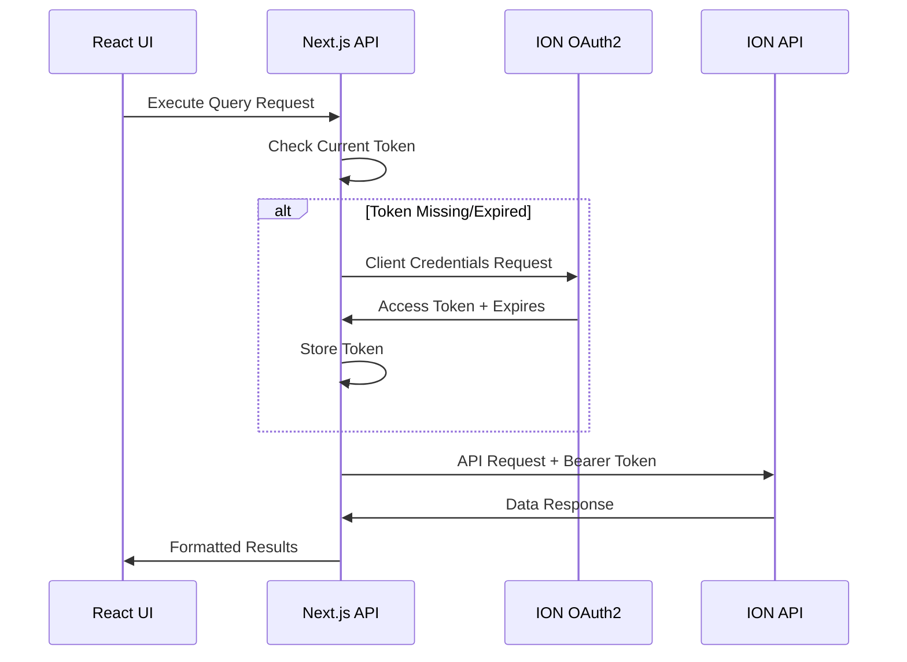
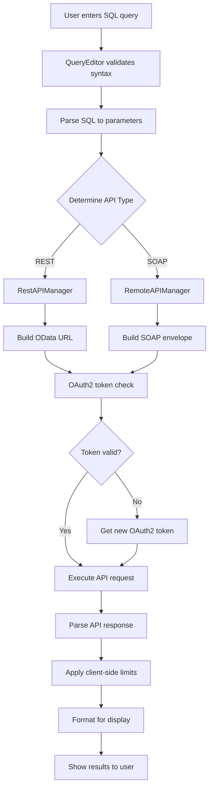

# Midport SQL Platform - Project Objectives & Architecture

## 🎯 **Project Overview**

The **Midport SQL Platform** is a unified query application that provides SQL-based access to both SOAP and REST APIs within the Infor ION ecosystem. Built with Next.js and React, it enables business users to query ERP data using familiar SQL syntax while handling complex OAuth2 authentication and API orchestration behind the scenes.

## 🎯 **Project Objectives**

### **Primary Objectives**

1. **Unified API Access**
   - Provide single interface for both SOAP and REST API consumption
   - Support hundreds of ION OData services (tdapi.*, tsapi.*, hrapi.*, finapi.*, etc.)
   - Abstract API complexity behind SQL-like query interface

2. **Business-Friendly Interface**
   - Convert technical service names to business-friendly terms
   - SQL query builder with visual editor
   - Real-time query execution with formatted results
   - Record limiting and pagination for performance

3. **Enterprise Authentication**
   - OAuth2 integration with Infor ION APIs
   - Secure token management and refresh
   - Multi-tenant support for different environments

4. **Developer Experience**
   - TypeScript-first architecture
   - Comprehensive error handling and logging
   - Extensible design for new API services
   - Client-side and server-side processing options

### **Secondary Objectives**

1. **Performance Optimization**
   - Client-side record limiting (default 15 records)
   - Efficient response parsing and caching
   - Optimized bundle size and loading times

2. **Operational Excellence**
   - Detailed logging for troubleshooting
   - Error recovery and retry mechanisms
   - Configuration management for different environments

3. **Scalability**
   - Support for multiple tenants and companies
   - Extensible service registry
   - Modular architecture for easy maintenance

## 🏗️ **High-Level Architecture**

### **Technology Stack**
- **Frontend:** Next.js 14, React 18, TypeScript
- **Backend:** Next.js API Routes, Node.js
- **Authentication:** OAuth2 Client Credentials Flow
- **APIs:** ION REST (OData v4), ION SOAP
- **Database:** SQLite (service registry)
- **Styling:** Tailwind CSS

### **Core Components**

#### **Frontend Layer**
```
┌─────────────────────────────────────────┐
│              UI Components              │
├─────────────────────────────────────────┤
│  • QueryEditor (SQL input & execution) │
│  • ServiceSidebar (API service browser)│
│  • ResultsDisplay (formatted output)   │
│  • APITypeIndicator (SOAP/REST visual) │
└─────────────────────────────────────────┘
```

#### **API Management Layer**
```
┌─────────────────────────────────────────┐
│           API Managers                  │
├─────────────────────────────────────────┤
│  • UnifiedAPIManager (router)          │
│  • RestAPIManager (OData/HTTP)         │
│  • RemoteAPIManager (SOAP/XML)         │
│  • OAuth2ConfigManager (auth)          │
└─────────────────────────────────────────┘
```

#### **Processing Layer**
```
┌─────────────────────────────────────────┐
│         Processing Components           │
├─────────────────────────────────────────┤
│  • SQLParser (query parsing)           │
│  • ResponseParser (unified parsing)    │
│  • ParameterExtractor (SQL to API)     │
│  • ResultFormatter (display prep)      │
└─────────────────────────────────────────┘
```

#### **Data Layer**
```
┌─────────────────────────────────────────┐
│            Data Sources                 │
├─────────────────────────────────────────┤
│  • SQLite Database (service registry)  │
│  • Environment Variables (config)      │
│  • ION APIs (external data)            │
│  • Token Storage (OAuth2 state)        │
└─────────────────────────────────────────┘
```

## 🔄 **Authentication & Request Flow**

### **OAuth2 Authentication Flow**



### **Complete Request Flow**



## 🛠️ **API Service Implementation**

### **REST API Service Creation**

#### **1. Service Registration**
```sql
-- Add to SQLite database
INSERT INTO tables (name, endpoint, apiType, oDataService, entityName) 
VALUES ('Sales Orders', 'tdapi.slsSalesOrder/Orders', 'rest', 'tdapi.slsSalesOrder', 'Orders');
```

#### **2. URL Construction**
```typescript
// RestAPIManager.ts
static buildIONODataUrl(tenant: string, oDataService: string, entityName: string): string {
  // Base: https://mingle-ionapi.eu1.inforcloudsuite.com/TENANT/LN/lnapi
  // Path: /odata/service/entity
  return `${BASE_ION_API_URL}/${tenant}/LN/lnapi/odata/${oDataService}/${entityName}`;
}
```

#### **3. Request Headers**
```typescript
const headers = {
  'Accept': 'application/json',
  'Content-Type': 'application/json',
  'Authorization': `Bearer ${accessToken}`,
  'OData-MaxVersion': '4.0',
  'OData-Version': '4.0',
  'X-Infor-LnCompany': '2405',
  'Content-Language': 'en-US'
};
```

#### **4. Query Parameter Generation**
```typescript
// SQL: SELECT * FROM Orders WHERE Status = 'Active' LIMIT 15
// Becomes: $filter=Status eq 'Active'
// Limit handled client-side (not $top)
```

### **SOAP API Service Creation**

#### **1. Service Registration**
```sql
INSERT INTO tables (name, endpoint, apiType) 
VALUES ('Business Partners', 'BusinessPartner_v3', 'soap');
```

#### **2. SOAP Envelope Construction**
```xml
<soap:Envelope xmlns:soap="http://schemas.xmlsoap.org/soap/envelope/">
  <soap:Header>
    <wsse:Security>
      <wsse:BinarySecurityToken>{{OAuth2_Token}}</wsse:BinarySecurityToken>
    </wsse:Security>
  </soap:Header>
  <soap:Body>
    <tns:List>
      <tns:Parameters>
        <tns:Tenant>MIDPORT_DEM</tns:Tenant>
        <tns:Company>2405</tns:Company>
      </tns:Parameters>
    </tns:List>
  </soap:Body>
</soap:Envelope>
```

#### **3. URL Construction**
```typescript
// RemoteAPIManager.ts
static buildIONAPIUrl(tenant: string, service: string): string {
  return `https://mingle-ionapi.eu1.inforcloudsuite.com/${tenant}/SOAP/LN/services/${service}`;
}
```

## 📊 **Request Generation Examples**

### **REST API Request Example**

```typescript
// Input SQL
const sql = "SELECT * FROM Orders WHERE Status = 'Active' AND Country = 'Norway' LIMIT 15";

// Parsed Parameters
const parameters = {
  Status: 'Active',
  Country: 'Norway',
  limit: 15
};

// Generated Request
const url = "https://mingle-ionapi.eu1.inforcloudsuite.com/MIDPORT_DEM/LN/lnapi/odata/tdapi.slsSalesOrder/Orders";
const queryString = "$filter=Status eq 'Active' and Country eq 'Norway'";
const finalUrl = `${url}?${queryString}`;

// Headers include OAuth2 + LN identity mapping
```

### **SOAP API Request Example**

```typescript
// Input SQL  
const sql = "SELECT * FROM BusinessPartners WHERE Type = 'Customer' LIMIT 15";

// Generated SOAP Request
const soapBody = `
<tns:List>
  <tns:Parameters>
    <tns:Tenant>MIDPORT_DEM</tns:Tenant>
    <tns:Company>2405</tns:Company>
    <tns:Type>Customer</tns:Type>
  </tns:Parameters>
</tns:List>`;

// Client-side limiting applied to response
```

## 🔐 **Security Architecture**

### **Authentication Security**
- **OAuth2 Client Credentials Flow** for service-to-service auth
- **Server-side token storage** - never exposed to browser
- **Automatic token refresh** before expiration
- **Environment variable protection** for sensitive credentials

### **API Security**
- **HTTPS-only communication** with ION APIs
- **Request validation** before API calls
- **Error sanitization** to prevent information leakage
- **Rate limiting** through record limits

### **Data Security**
- **No persistent data storage** of business data
- **Session-based result caching** only
- **Secure header transmission** for identity mapping
- **Input sanitization** for SQL injection prevention

## 🎯 **Success Metrics**

### **Technical Metrics**
- **Query Response Time:** < 5 seconds average
- **OAuth2 Token Success Rate:** > 99%
- **API Error Rate:** < 2%
- **Client-side Limiting:** 15 records default (configurable)

### **Business Metrics**
- **User Adoption:** Easy SQL interface for business users
- **Service Coverage:** Support for 100+ ION OData services
- **Error Resolution:** Clear error messages and troubleshooting
- **Development Velocity:** Fast addition of new services

## 📈 **Future Roadmap**

### **Phase 1: Core Functionality** ✅
- [x] OAuth2 authentication
- [x] REST and SOAP API support
- [x] SQL query interface
- [x] Basic error handling

### **Phase 2: Enhanced Features** 🔄
- [x] Client-side record limiting
- [x] Business-friendly service names
- [x] API type indicators
- [ ] Advanced query builder UI
- [ ] Result export functionality

### **Phase 3: Enterprise Features** 📋
- [ ] Multi-tenant dashboard
- [ ] Advanced caching strategies  
- [ ] Real-time query performance monitoring
- [ ] Custom service definitions
- [ ] Query history and favorites

---

**Project:** Midport SQL Platform  
**Version:** 1.0.0  
**Last Updated:** October 2025  
**Author:** Mulugeta Forsido  
**Company:** Midport Scandinavia